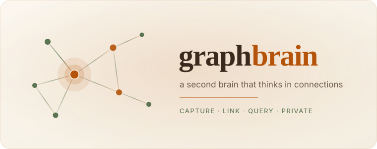

<div align="center">

   

**_Capture. Link. Query — privately._**

A second brain that thinks in connections. Capture, link, and query everything
you know, powered by a real knowledge graph and a local AI assistant that
never sends your data anywhere.

[]()
[](https://nodejs.org)
[](https://www.typescriptlang.org)
[](https://react.dev)
[](https://nextjs.org)
[](https://supabase.com)
[](https://tailwindcss.com)
[](./LICENSE)

</div>

<br>

## Contents

- [Highlights](#highlights)
- [How it works](#how-it-works)
- [Tech stack](#tech-stack)
- [Quick start](#quick-start)
- [Desktop app](#desktop-app)
- [Testing](#testing)
- [Project structure](#project-structure)
- [License](#license)

## Highlights

- **Pages & blocks** — a fast, keyboard-driven rich-text editor built on
  [Tiptap](https://tiptap.dev): slash commands, callouts, toggles, task lists,
  and more.
- **Databases** — structured collections with four views — **Table, Kanban,
  Calendar, and Time** — plus a configurable schema editor.
- **Knowledge graph** — pages, blocks, files, and database rows are linked
  automatically through mentions, backlinks, and parent/child relationships.
- **Local AI Q&A** — semantic search and retrieval-augmented answers over your
  own workspace, streamed from [Ollama](https://ollama.com). Nothing leaves
  your device.
- **File import** — drop in PDFs, Word documents, and text/Markdown; content is
  extracted and woven into the graph for you.
- **Workspaces & collaboration** — multi-user workspaces with owner / editor /
  viewer roles, email invites, and row-level security enforced at the database.
- **Command palette** — instant ⌘K / Ctrl+K search across pages, databases, and
  files.
- **Native desktop app** — a macOS build ([Electron](https://www.electronjs.org))
  that wraps the same product, no browser required.

## How it works

Pages, databases, and files aren't stored side by side. In graphbrain, **every
page, block, file, and database row becomes a node** in one connected graph.

When you ask a question, graphbrain walks that graph:

```text
question ──▶ embed ──▶ pgvector search ──▶ traverse edges ──▶ local LLM ──▶ answer + citations
```

It embeds your question, retrieves the most relevant nodes, and answers using a
locally-running LLM — always citing the exact pages and rows it drew from.

> **Private by design.** Embeddings and answers are produced by
> [Ollama](https://ollama.com) on your own machine. Your pages, questions, and
> files never travel to a third party, and row-level security keeps every
> multi-user workspace cleanly separated.

## Tech stack

| Layer          | Technology                                                            |
| -------------- | -------------------------------------------------------------------- |
| **Framework**  | [Next.js 16](https://nextjs.org) (App Router) · React 19 · TypeScript |
| **Database**   | [Supabase](https://supabase.com) — Postgres, Auth, Storage, RLS       |
| **Vector search** | [pgvector](https://github.com/pgvector/pgvector) — embedding-based retrieval |
| **Local AI**   | [Ollama](https://ollama.com) — `nomic-embed-text` embeddings + chat    |
| **Editor**     | [Tiptap](https://tiptap.dev)                                          |
| **Styling**    | Tailwind CSS 4 · [shadcn/ui](https://ui.shadcn.com)                  |
| **Desktop**    | [Electron](https://www.electronjs.org) + electron-builder             |
| **Testing**    | [Vitest](https://vitest.dev) · [Playwright](https://playwright.dev)   |

## Quick start

### Prerequisites

- **Node.js 20** or later
- A [Supabase](https://supabase.com) project (the free tier is enough)
- [Ollama](https://ollama.com) installed locally, with an embedding model
  pulled — this powers the graph and the Ask features:

  ```bash
  ollama pull nomic-embed-text
  ```

  For Ask, keep a local chat model available in Ollama as well (the app ships
  configured for a local Gemma model).

### Setup

1. **Clone and install dependencies**

   ```bash
   git clone https://github.com/Abubakarjutt/graphbrain.git
   cd graphbrain
   npm install
   ```

2. **Configure environment variables**

   Copy `.env.example` to `.env.local` and fill in your Supabase project's URL
   and publishable (anon) key:

   ```bash
   cp .env.example .env.local
   ```

   ```env
   NEXT_PUBLIC_SUPABASE_URL=your_supabase_project_url
   NEXT_PUBLIC_SUPABASE_ANON_KEY=your_supabase_publishable_key
   ```

   Optionally, set `OLLAMA_URL` if Ollama isn't running on the default
   `http://localhost:11434`.

3. **Apply the database schema**

   Push the migrations in `supabase/migrations/` to your Supabase project with
   the [Supabase CLI](https://supabase.com/docs/guides/cli):

   ```bash
   npx supabase link --project-ref <your-project-ref>
   npx supabase db push --db-url <your-postgres-connection-string>
   ```

4. **Run the app**

   ```bash
   npm run dev
   ```

   Open [http://localhost:3000](http://localhost:3000).

## Desktop app

graphbrain also ships as a native macOS app.

```bash
npm run electron:dev     # run the desktop shell against your local dev server
npm run build:desktop    # produce a distributable .dmg in release/
```

The desktop build bakes in the Supabase backend configured in `.env.local` at
build time — end users never configure a backend or touch a terminal.

## Testing

```bash
npm test           # unit & integration tests (Vitest)
npm run test:e2e   # end-to-end tests (Playwright)
npm run lint       # ESLint
```

## Project structure

```text
graphbrain/
├─ src/
│  ├─ app/                Next.js App Router routes
│  │  ├─ (app)/           Workspace, pages, databases, Ask, and settings
│  │  ├─ (auth)/          Login, signup, and email invites
│  │  └─ api/query/ask    Streaming retrieval-augmented endpoint
│  ├─ components/
│  │  ├─ editor/          Block editor, slash menu, callouts, toggles
│  │  ├─ database/        Table, Kanban, Calendar, and Time views
│  │  ├─ query/           Command palette (⌘K) and Ask UI
│  │  ├─ files/           File upload, extraction, and preview
│  │  ├─ layout/          App shell, sidebar, and navigation
│  │  └─ auth/            Auth screens and animated graph backdrop
│  └─ lib/
│     ├─ actions/         Server actions (workspaces, pages, databases, files, todos)
│     ├─ graph/           Graph construction, embeddings, and retrieval
│     ├─ parsing/         PDF / DOCX / HTML / text → Markdown
│     ├─ hooks/           Client hooks (streaming Ask)
│     └─ supabase/        Supabase client setup
├─ supabase/migrations/   Schema, RLS policies, and RPCs
├─ electron/              Desktop app entry point and packaging config
├─ e2e/                   Playwright end-to-end tests
└─ scripts/               Notion import and embedding-backfill utilities
```

## License

[MIT](./LICENSE) © 2026 Muhammad Abubakar
